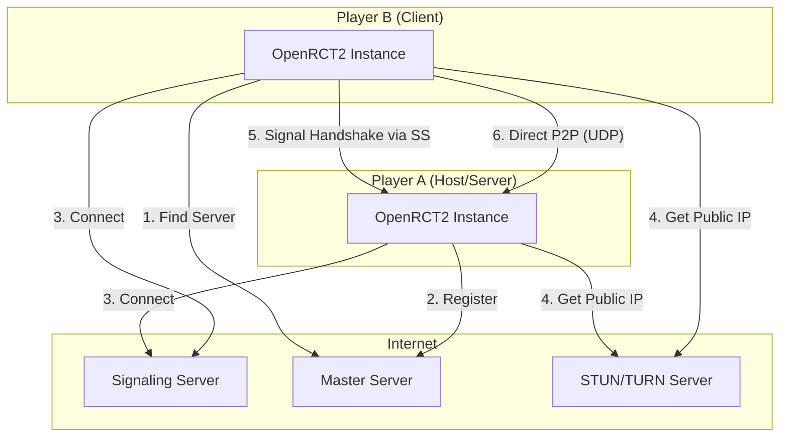
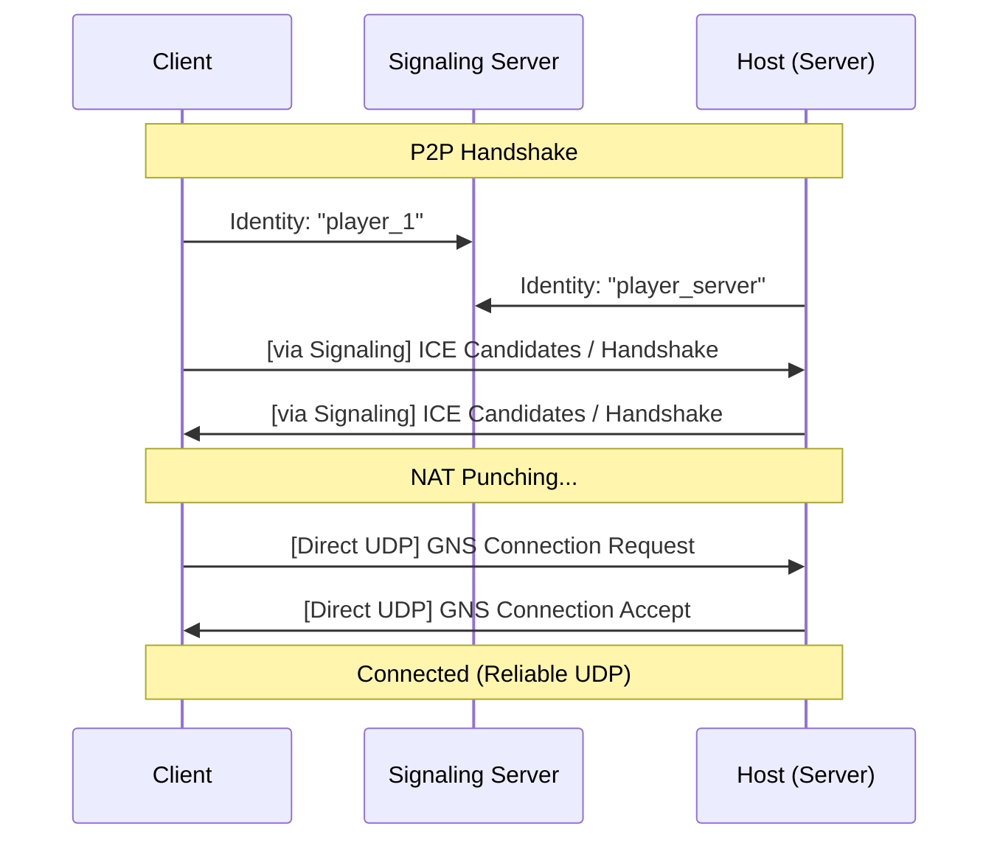

# OpenRCT2 Networking Migration Guide: Moving to GameNetworkingSockets

This document provides a comprehensive guide for replacing OpenRCT2's current networking code with the `GameNetworkingSockets` library. It covers architectural changes, infrastructure requirements, and implementation details for maintaining deterministic simulation sync.

## Table of Contents
1. [Why GameNetworkingSockets?](#why-gamenetworkingsockets)
2. [Infrastructure Requirements](#infrastructure-requirements)
3. [Architecture Overview](#architecture-overview)
4. [Signaling Service (P2P NAT Traversal)](#signaling-service-p2p-nat-traversal)
5. [Deterministic Lockstep Integration](#deterministic-lockstep-integration)
6. [Master Server & LAN Discovery](#master-server--lan-discovery)
7. [API Mapping Examples](#api-mapping-examples)

---

## Why GameNetworkingSockets?

OpenRCT2 currently relies on a custom TCP/UDP protocol. Migrating to `GameNetworkingSockets` (GNS) offers several advantages:
- **NAT Traversal**: Built-in ICE/STUN/TURN support allows players to host servers behind home routers without manual port forwarding.
- **Reliable UDP**: Combines the reliability of TCP with the performance of UDP.
- **Encryption**: Automatic AES-GCM encryption for all packets.
- **Congestion Control**: Modern algorithms to handle varying network conditions better than standard TCP.

---

## Infrastructure Requirements

To support a full P2P-capable deployment, you need the following infrastructure:

1. **Signaling Server**: A simple relay for "handshake" messages between peers who cannot yet talk directly.
2. **STUN Servers**: Used by peers to discover their public IP addresses. Public servers (like Google's) are usually sufficient.
3. **TURN Servers**: (Optional but recommended) Used as a fallback relay when direct NAT punching fails.
4. **Master Server**: Your existing server listing service, which now needs to store and distribute `SteamNetworkingIdentity` strings.

### Port Requirements
| Service | Protocol | Default Port | Requirement |
|---------|----------|--------------|-------------|
| Game Server | UDP | 11753 | Only if not using P2P/Signaling |
| Signaling Server | TCP | 10000 | Must be publicly accessible |
| STUN Server | UDP | 3478 | Outbound access required |
| TURN Server | UDP/TCP | 3478 | Only if direct P2P fails |

---

## Architecture Overview

### High-Level Deployment


### Connection Flow


---

## Signaling Service (P2P NAT Traversal)

The signaling service is the most critical new piece of infrastructure. It does not carry game traffic; it only carries the initial ICE negotiation packets (~2-5 KB total per connection).

### C++ Signaling Server Implementation
A production-ready signaling server should handle non-blocking I/O and identity-based routing. See `examples/cpp_signaling_server.cpp` for a robust implementation.

**Key Requirements:**
- Must maintain a mapping of `Identity -> Socket`.
- Must forward messages based on the destination identity provided in the envelope.
- Should implement rate limiting and basic authentication to prevent abuse.

---

## Deterministic Lockstep Integration

OpenRCT2 uses a deterministic simulation. GNS handles packet reliability and ordering, but the game must still manage "Tick Sync".

### Mapping Ticks to GNS Messages

1. **Commands**: All player actions (Build, Change Price, etc.) must be sent using `k_nSteamNetworkingSend_ReliableNoNagle`.
   - `Reliable`: Ensures the command is never lost.
   - `NoNagle`: Ensures the command is sent immediately at the end of the current frame, reducing latency.

2. **Tick Packets**: The server should broadcast a "Tick" message every simulation step.
   ```cpp
   // Typical Tick Packet
   struct TickPacket {
       uint32_t serverTick;
       uint32_t hash; // For desync detection
   };
   ```

3. **Avoid Desyncs**:
   - Use `ISteamNetworkingSockets::SendMessageToConnection` with the `Reliable` flag for all simulation-impacting data.
   - **Do NOT** use `ISteamNetworkingMessages` for simulation data, as it is harder to track connection state changes which could lead to missed ticks.
   - Buffer incoming commands and only execute them when the simulation reaches the specific `tick` indicated in the packet.

---

## Master Server & LAN Discovery

### Master Server Integration (C#)
Since the OpenRCT2 Master Server is written in C#, use the [ValveSockets-CSharp](https://github.com/nxrighthere/ValveSockets-CSharp) or [Facepunch.Steamworks](https://github.com/Facepunch/Facepunch.Steamworks) bindings.

The Master Server should now store the `SteamNetworkingIdentity` (e.g., `generic:myserver`) instead of just an IP/Port.

### LAN Discovery
GNS supports local discovery via ICE. When both peers are on the same LAN, they will exchange local IP candidates (e.g., `192.168.1.5`) via the Signaling Server and establish a direct high-speed connection.

To maintain "Offline LAN" support (no internet/signaling), you should keep the existing UDP broadcast mechanism to exchange `SteamNetworkingIdentity` and local IP/Port info between clients.

---

## API Mapping Examples

### Connecting to a Server (Client)
```cpp
// 1. Initialize Signaling
m_pSignalingClient = CreateTrivialSignalingClient("signaling.openrct2.org:10000", m_pInterface, errMsg);

// 2. Create Signaling object for the specific host
SteamNetworkingIdentity serverID;
serverID.ParseString("generic:server_identity_from_master_server");
auto* pSignaling = m_pSignalingClient->CreateSignalingForConnection(serverID, errMsg);

// 3. Connect
m_hConn = m_pInterface->ConnectP2PCustomSignaling(pSignaling, &serverID, 0, 0, nullptr);
```

### Sending a Reliable Command
```cpp
void SendGameCommand(const void* data, size_t size) {
    // k_nSteamNetworkingSend_ReliableNoNagle is the "TCP_NODELAY" equivalent
    m_pInterface->SendMessageToConnection(m_hConn, data, size, k_nSteamNetworkingSend_ReliableNoNagle, nullptr);
}
```

### Receiving Messages
```cpp
void PollNetwork() {
    SteamNetworkingMessage_t* pIncomingMsg = nullptr;
    int numMsgs = m_pInterface->ReceiveMessagesOnConnection(m_hConn, &pIncomingMsg, 1);
    if (numMsgs > 0) {
        // Process message...
        pIncomingMsg->Release();
    }
}
```

For a full working example, see `examples/openrct2_style_example.cpp`.
